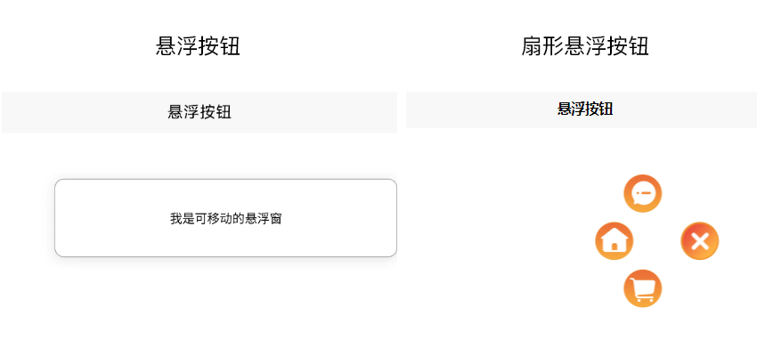
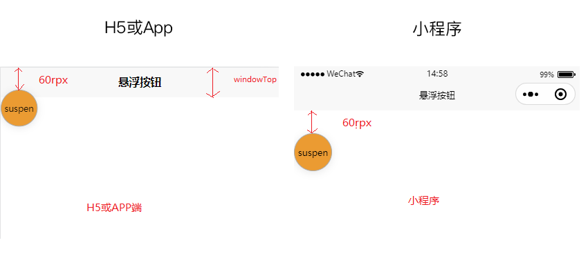
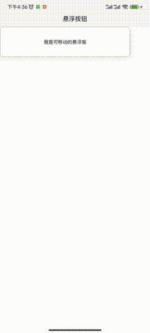
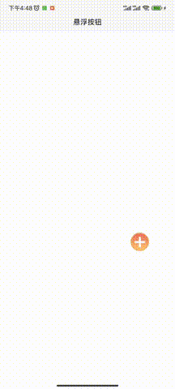

Vue移动端手把手教你封装一个可移动悬浮窗、可移动打开扇形悬浮按钮组件

## 前言
悬浮窗、悬浮按钮是项目中常见的一种交互设计，特别是在移动端上有着广泛的使用，可以进行一些重要信息展示或者提供便捷的交互操作，比如手机网速内存信息显示的悬浮窗，联系客服悬浮按钮，录制视频的开始或结束悬浮按钮，快速到页面顶部或者底部悬浮按钮等。本文将手把手教你封装一个可移动的悬浮框组件，利用悬浮窗在进阶封装一个可展开可移动的扇形悬浮按钮组件。本案例将以移动端为背景采用`uniapp`技术实现一个三端（`H5、小程序、APP`）通用的悬浮组件。

## 功能设计
- 悬浮窗在页面可视区域内根据手指触摸自由移动
- 悬浮窗各边缘跟可视区域边界相切，不能移出屏幕外
- 悬浮窗样式布局可自定义（按钮、长条风格等），内容可自定义（展示内容），初始化位置可自定义
- H5、小程序、APP三端通用



## 技术实现分析
### 1.如何实现悬浮可移动，并禁止移出屏幕
首先悬浮框使用`fixed`布局，通过监听`touchmove`触摸移动事件实时获取当前位置坐标`（x,y）`动态设置组件的`top`和`left`值，组件就能跟着手触摸移动而移动。禁止移出屏幕需要结合组件本身宽高、屏幕宽高、计算出最大可移动距离，限制`top`和`left`值范围。
```vue
<template>
  <view class="supenpopup"
        :style="{top:`${elTop}px`,left:`${elLeft}px`,width:`${width}rpx`,height:`${height}rpx`,zIndex}"
        @touchmove.prevent.stop="onTouchMove" @touchstart="onTouchStart">
    <!-- 插槽-自定义内容 -->
    <slot></slot>
  </view>
</template>
```
```js
export default {
  data() {
    return {
      elTop: 0, //组件距离顶部距离
      elLeft: 0, //组件距离左边距离
      windowHeight: 0, //窗口高度
      windowWidth: 0, //窗口宽度
      rate: 0, //px和rpx换算比例
      windowTop: 0, //窗口距离屏幕顶部距离
      startX: 0, //开始移动触摸点x坐标，相对页面左上角
      startY: 0, //开始移动点触摸点y坐标，，相对页面左上角
      startTop: 0, //悬浮框顶部距离顶部距离，小程序相对页面顶部，h5和app相对屏幕顶部
      startLeft: 0, //悬浮窗左边距离页面左边距离
    }
  }
}
```
```js
export default {
  methods: {
    //开始移动
    onTouchStart(e) {
      //记录开始时候触摸点坐标
      this.startX = e.touches[0].clientX;
      this.startY = e.touches[0].clientY

      //记录移动前组件位置
      this.startTop = this.elTop
      this.startLeft = this.elLeft
    },
    //移动中
    onTouchMove(e) {
      let x = e.touches[0].clientX;
      let y = e.touches[0].clientY;
      //忽略触摸屏幕最左边外面
      if (x < 0) {
        x = 0;
      }

      //当前组件距离左边位置=开始位置(x轴)+（当前触摸点x坐标-开始移动触摸点x坐标）
      let elLeft = this.startLeft + (x - this.startX);

      //悬浮窗右边限制移出屏幕外 this.rate单位换算比例，windowWidth单位px，width单位rpx
      //屏幕宽度-组件宽度=组件最大向左可移动距离（elLeft）
      //可移动范围elLeft值限制在0~（this.windowWidth - this.width / this.rate）范围内
      elLeft = Math.min(elLeft, this.windowWidth - this.width / this.rate)
      this.elLeft = elLeft > 0 ? elLeft : 0

      //忽略触摸屏幕最顶部外面
      if (y < 0) {
        y = 0;
      }
      let elTop = this.startTop + (y - this.startY);

      //悬浮窗限制移出屏幕底部
      //可移动范围elTop值限制在this.windowTop~（this.windowHeight - this.height / this.rate + this.windowTop）范围内
      elTop = Math.min(elTop, this.windowHeight - this.height / this.rate + this.windowTop)
      //悬浮窗限制移到导航栏上或移出屏幕顶部
      this.elTop = Math.max(elTop, this.windowTop)
    },
  }
}
```
### 2.悬浮窗自定义
通过组件的`prop`属性定义宽高、起始位置`top`和`left`值以及层级（`z-index`）可按需传入设置,内容样式（按钮风格、方形等）通过插槽保留自定义入口

```js
export default {
  props: {
    //组件高，单位rpx
    height: {
      type: [String, Number],
      default: 100
    },
    //组件宽，单位rpx
    width: {
      type: [String, Number],
      default: 100
    },
    //起始位置距离顶部距离，单位rpx,auto:自动设置，将位于页面最顶端
    top: {
      type: [String, Number],
      default: 'auto'
    },
    //起始位置距离左边距离，单位rpx，auto:自动设置，将位于页面最左边
    left: {
      type: [String, Number],
      default: 'auto'
    },
    //层级
    zIndex: {
      type: Number,
      default: 999
    }
  },
}
```
### 3.多端兼容性
`fixed`布局在不同端相对基点位置是不一样的，`H5、APP`基点是在屏幕左上角（导航栏上）而小程序是页面左上角（导航栏下面）。而不管哪端`touchmove`获取到的坐标（`clientX，clientY`）相对基点是页面左上角，所以在设置`H5、APP`端的`top`值时候需要在加上导航栏底部到屏幕顶部距离,而这个距离我们可以通过`uni.getSystemInfo`返回的`windowTop`字段获取（小程序该值为0），所以动态设置`top`值时候可以=`组件当前位置+windowTop`

`fixed布局，top=60rpx在不同端的效果`



```js
export default {
  created() {
    uni.getSystemInfo({
      success: res => {
        this.windowWidth = res.windowWidth;//页面可视区域宽度
        this.rate = 750 / this.windowWidth;//rpx和px转换比例
        this.windowHeight = res.windowHeight;//页面可是区域高度
        this.windowTop = res.windowTop;//页面距离窗口顶部距离
        //设置初始位置,APP端和H5将基于屏幕最顶部定位，而小程序windowTop为0基于页面顶部
        this.elTop = this.top === 'auto' ? this.windowTop : this.top / this.rate;
        this.elLeft = this.left === 'auto' ? 0 : this.left / this.rate;
      },
    });
  },
}
```
## 技术细节-API回顾
### @touchstart 事件
手指开始触摸元素触发
```js
element.touchstart(options: Object): Promise<void>
```
options 字段定义如下：
| 字段 | 类型 | 说明 |
| - | :-: | - |
| touches | array | 触摸事件，当前停留在屏幕中的触摸点信息的数组 |
| changedTouches | array | 触摸事件，当前变化的触摸点信息的数组 |

touches对象定义如下：
| 字段 | 类型 | 说明 |
| - | :-: | - |
| identifier | Number | 触摸点的标识符 |
| pageX, pageY | Number | 距离文档左上角的距离，文档的左上角为原点 ，横向为X轴，纵向为Y轴 |
| clientX, clientY | Number | 	距离页面可显示区域（屏幕除去导航条）左上角距离，横向为X轴，纵向为Y轴 |

### @touchmove事件
手指在屏幕上滑动时候连续触发
```js
element.touchmove(options: Object): Promise<void>
```
`options` 字段同 `touchstart`。

两个事件都会冒泡，取消冒泡可通过修饰符设置例如：`@touchmove.prevent.stop`

## 完整的代码实现（悬浮窗）
suspenPopup.vue 

```vue
<!-- 悬浮窗 -->
<template>
  <view class="supenpopup"
        :style="{top:`${elTop}px`,left:`${elLeft}px`,width:`${width}rpx`,height:`${height}rpx`,zIndex}"
        @touchmove.prevent.stop="onTouchMove" @touchstart="onTouchStart">
    <!-- 插槽-自定义内容 -->
    <slot></slot>
  </view>
</template>

<script>
export default {
  props: {
    //组件高，单位rpx
    height: {
      type: [String, Number],
      default: 100
    },
    //组件宽，单位rpx
    width: {
      type: [String, Number],
      default: 100
    },
    //起始位置距离顶部距离，单位rpx,auto:自动设置，将位于页面最顶端
    top: {
      type: [String, Number],
      default: 'auto'
    },
    //起始位置距离左边距离，单位rpx，auto:自动设置，将位于页面最左边
    left: {
      type: [String, Number],
      default: 'auto'
    },
    //层级
    zIndex: {
      type: Number,
      default: 999
    }
  },

  data() {
    return {
      elTop: 0, //组件距离顶部距离
      elLeft: 0, //组件距离左边距离
      windowHeight: 0, //窗口高度
      windowWidth: 0, //窗口宽度
      rate: 0, //px和rpx换算比例
      windowTop: 0, //窗口距离屏幕顶部距离
      startX: 0, //开始移动触摸点x坐标，相对页面左上角
      startY: 0, //开始移动点触摸点y坐标，，相对页面左上角
      startTop: 0, //悬浮框顶部距离顶部距离，小程序相对页面顶部，h5和app相对屏幕顶部
      startLeft: 0, //悬浮窗左边距离页面左边距离
    }
  },
  created() {
    uni.getSystemInfo({
      success: res => {
        this.windowWidth = res.windowWidth;//页面可视区域宽度
        this.rate = 750 / this.windowWidth;//rpx和px转换比例
        this.windowHeight = res.windowHeight;//页面可是区域高度
        this.windowTop = res.windowTop;//页面距离窗口顶部距离
        //设置初始位置,APP端和H5将基于屏幕最顶部定位，而小程序windowTop为0基于页面顶部
        this.elTop = this.top === 'auto' ? this.windowTop : this.top / this.rate;
        this.elLeft = this.left === 'auto' ? 0 : this.left / this.rate;
      },
    });
  },
  methods: {
    //开始移动
    onTouchStart(e) {
      //记录开始时候触摸点坐标
      this.startX = e.touches[0].clientX;
      this.startY = e.touches[0].clientY

      //记录移动前组件位置
      this.startTop = this.elTop
      this.startLeft = this.elLeft
    },
    //移动中
    onTouchMove(e) {
      let x = e.touches[0].clientX;
      let y = e.touches[0].clientY;
      //忽略触摸屏幕最左边外面
      if (x < 0) {
        x = 0;
      }

      //当前组件距离左边位置=开始位置(x轴)+（当前触摸点x坐标-开始移动触摸点x坐标）
      let elLeft = this.startLeft + (x - this.startX);

      //悬浮窗右边限制移出屏幕外 this.rate单位换算比例，windowWidth单位px，width单位rpx
      //屏幕宽度-组件宽度=组件最大向左可移动距离（elLeft）
      //可移动范围elLeft值限制在0~（this.windowWidth - this.width / this.rate）范围内
      elLeft = Math.min(elLeft, this.windowWidth - this.width / this.rate)
      this.elLeft = elLeft > 0 ? elLeft : 0

      //忽略触摸屏幕最顶部外面
      if (y < 0) {
        y = 0;
      }
      let elTop = this.startTop + (y - this.startY);

      //悬浮窗限制移出屏幕底部
      //可移动范围elTop值限制在this.windowTop~（this.windowHeight - this.height / this.rate + this.windowTop）范围内
      elTop = Math.min(elTop, this.windowHeight - this.height / this.rate + this.windowTop)
      //悬浮窗限制移到导航栏上或移出屏幕顶部
      this.elTop = Math.max(elTop, this.windowTop)
    },
  },
}
</script>

<style lang="scss" scoped>
.supenpopup {
  position: fixed;
  z-index: 999;
}
</style>
```
index.vue 调用组件

```vue

<template>
  <view>
    <!-- 悬浮窗 -->
    <suspenPopup top="auto" left="40" height="150" width="650">
      <view class="supen-popup">我是可移动的悬浮窗</view>
    </suspenPopup>
  </view>
</template>

<script>
import suspenPopup from './component/suspenPopup.vue'
export default {
  components: {
    suspenPopup,
  },
}
</script>
<style lang="scss" scoped>
.supen-popup {
  display: flex;
  justify-content: center;
  align-items: center;
  border-radius: 20rpx;
  box-sizing: border-box;
  background: white;
  box-shadow: 0 2px 12px 0 rgba(0, 0, 0, 0.1);
  border: 1px solid #aaa;
  font-size: 24rpx;
  width: 100%;
  height: 100%;
}
</style>
```


## 进阶封装——可移动扇形展开悬浮按钮
### 实现效果演示

### 需求分析
可以看到在未展开状态下就是一个悬浮窗，我们可以在之前封装好的悬浮窗基础上进行内容自定义。

整个组件一共由4个部分组成，中心按钮、顶部按钮、底部按钮、左边按钮，当未展开时候4个按钮重叠在一起中心按钮在最上面，

当点击中心按钮时候中心按钮不移动动只旋转一定角度，其他三个按钮类似发射效果，同时分别沿着不同角度做平移运动并且自身也在旋转，而再次点击中心按钮关闭时候跟打开是个逆过程。

扇形展开效果实际上就是一个简单的动画特效，以顶部按钮分析它的动画，移动轨迹分解为往上移动y距离，往左移动x距离，整个过程发射角度是不变的大约30-45度之间。实现这个动画我们很容易想到`css`属性`transition`，在配合绝对或者相对布局设置`top`和`left`即可

### 代码实现
```vue
<template>
  <suspenPopup >
    <!-- top按钮 -->
    <view :class="['button','top',btnClass]">
      <image class="icon" src="/static/top.png" mode="widthFix"></image>
    </view>
    <!-- bottom按钮 -->
    <view :class="['button','bottom',btnClass]">
      <image  class="icon" src="/static/bottom.png" mode="widthFix"></image>
    </view>
    <!-- left按钮 -->
    <view :class="['button ','left',btnClass]">
      <image  class="icon" src="/static/left.png" mode="widthFix"></image>
    </view>
    <!-- 中心按钮 -->
    <view :class="['button','center',btnClass]" @click="handleOpen">
      <image  class="icon" src="/static/center.png" mode="widthFix"></image>
    </view>
  </suspenPopup>
</template>

<script>
import suspenPopup from './suspenPopup.vue' //悬浮窗组件
export default {
  components: {
    suspenPopup
  },
  data() {
    return {
      isOpen: null, //是否打开
    }
  },
  computed: {
    //中心按钮class
    btnClass() {
      return this.isOpen === true ? 'open' : this.isOpen === false ? 'close' : null
    }
  },
  methods: {
    handleOpen() {
      this.isOpen = !this.isOpen
    }
  }
}
</script>

<style lang="scss" scoped>
.button {
  border-radius: 50%;
  position: absolute;
  left: 0;
  top: 0;
  height: 80rpx;
  width: 80rpx;
  background: rgb(235, 155, 50);
  display: flex;
  flex-direction: column;
  justify-content: center;
  align-items: center;
  z-index: 99999;
  overflow: hidden;
  transition: all 0.5s ease;
  font-size: 24rpx;
  .icon{
    width: 100%;
  }
  /**中心按钮**/
  &.center {
    &.open {
      transform: rotate(315deg);
    }
    &.close {
      transform: rotate(0deg);
    }
  }

  /**顶部按钮**/
  &.top {
    opacity: 0;
    &.open {
      top: -100rpx;
      left: -120rpx;
      transform: rotate(360deg);
      opacity: 1
    }
    &.close {
      top: 0rpx;
      left: 0rpx;
      transform: rotate(360deg);
      opacity: 0
    }
  }
  /**底部按钮**/
  &.bottom {
    opacity: 0;
    &.open {
      top: 100rpx;
      left: -120rpx;
      transform: rotate(360deg);
      opacity: 1
    }
    &.close {
      top: 0rpx;
      left: 0rpx;
      transform: rotate(360deg);
      opacity: 0
    }
  }
  /**左边按钮**/
  &.left {
    opacity: 0;
    &.open {
      top: 0rpx;
      left: -180rpx;
      transform: rotate(360deg);
      opacity: 1
    }
    &.close {
      top: 0rpx;
      left: 0rpx;
      transform: rotate(360deg);
      opacity: 0
    }
  }
}
</style>
```


