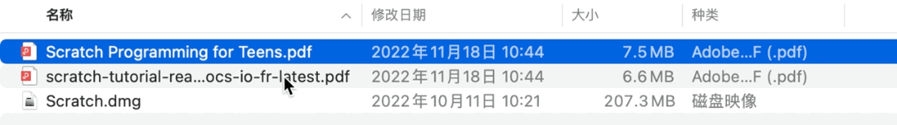
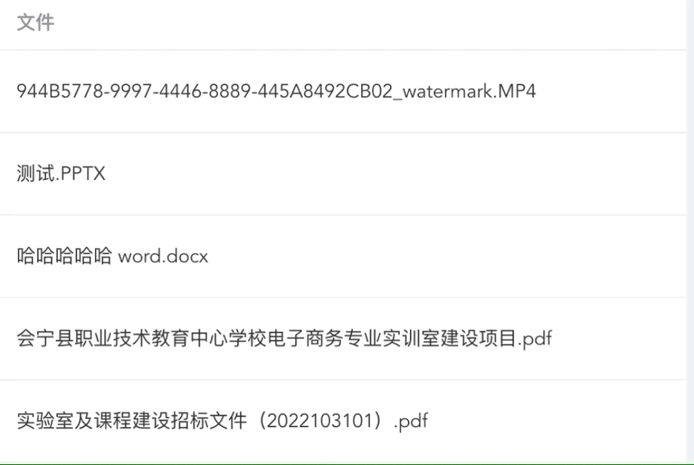

CSS文本超出中间内容省略号

在`Mac`文件管理中有这样一个小细节999000
1. 当文件名`不超过一行`时，完整显示，此时鼠标放上去无任何提示
2. 当文件名`超过一行`时，出现省略号，此时鼠标放上去提示显示完整文件名


## CSS 实现思路
`title` 属性是预先添加的，并且无法通过样式来控制是否显示，那么，CSS 如何做到动态处理呢？

- 虽然 `CSS` 无法动态去改变 `title` 属性，换个思路，假如有两份相同的文本，其中一份是带有 `title` 属性的
- 多行文本判断，当文本超出一行时，高度必然会发生变化，假设行高为 1.5，那么1行文本就是 1.5em，2行就是 3em，依次类推...如果我们限制文本A的最大高度为两行，那么一行和多行不就区分开了吗（单行高度是1.5em，多行高度是3em）

## 实现
```vue
<template>
  <div class="hidden-center">
    <span class="txt">{{scope.row.file_name}}</span>
    <span class="title" :title="scope.row.file_name">{{scope.row.file_name}}</span>
  </div>
</template>
<style scoped lang="scss">
.hidden-center {
  width: 300px;
  position: relative;
  //line-height: 2;
  height: 23px;
  overflow: hidden;
  background: var(--el-fill-color-blank);
  transition: background-color .25s ease;
}
.title {
  display: block;
  position: relative;
  background: inherit;
  text-align: justify;
  height: 23px;
  overflow: hidden;
  top: -46px;
}
.txt {
  display: block;
  max-height: 46px;
}
.title::before{
  content: attr(title);
  width: 50%;
  float: right;
  white-space: nowrap;
  overflow: hidden;
  text-overflow: ellipsis;
  direction: rtl;
}
</style>
```
## 效果



