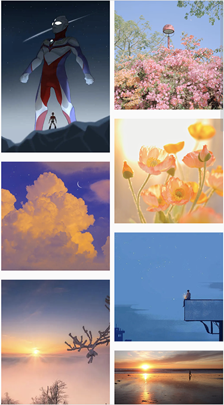

Vue瀑布流布局多种实现方式

## 前言
瀑布流布局是网页设计常见的一种布局，一般用于图片多列展示。列宽固定，图片根据自身高度自适应`交错排列`。


## 实现方式
### 实现原理
通过动态计算哪一列高度最低，就把图片放置该列下显示，直至所有图片分列完毕

计算哪一列高度最低具体实现过程又分2种方式：

1. 通过计算每一列每张图片渲染后高度进行累加就是该列的高度，记录每列累加高度比较大小
2. 直接通过图片父级元素高度（列div）来判断哪一列最低

区别：方式1无需等待图片真实渲染完成在比较高度，方式2需要等待图片真实渲染完成在获取高度

实现：以左右2列为例
```vue
<template>
  <el-scrollbar>
<!--    方法一-->
    <div class="page">
      <!-- 左图片列表 -->
      <div class="left" ref="leftRef">
        
      </div>
      <!-- 右图片列表 -->
      <div class="right" ref="rightRef">
        
      </div>
    </div>
  </el-scrollbar>
</template>

<style scoped lang="scss">
.page {
  width: 100%;
  display: flex;
  align-items: flex-start;
  box-sizing: border-box;
}
.left, .right {
  margin: 0 auto;
  width: 48%;
}
.img {
  width: 100%;
  height: auto;
  margin-bottom: 10px;
}
</style>
```
### 方式一（图片高度累加比较法）
```ts
import {nextTick, onMounted, ref} from 'vue'

const leftRef = ref()
const rightRef = ref()
//所有图片
const imgList = ref([
  "https://inews.gtimg.com/newsapp_bt/0/13927499971/641",
  "https://picx.zhimg.com/70/v2-d094166746ca67d2a2ed61042e2675ce_1440w.avis?source=172ae18b&biz_tag=Post",
  "https://pic4.zhimg.com/80/v2-570aad7dbef96e49ab01780ab7ebc98b_1440w.webp",
  "https://pic2.zhimg.com/80/v2-7f5e7ec5909bc70c37badc889ed52089_1440w.webp",
  "https://pic3.zhimg.com/80/v2-60ff489b4f2809e55d716c7cc3c04eca_1440w.webp",
  "https://img0.baidu.com/it/u=1604010673,2427861166&fm=253&fmt=auto&app=138&f=JPEG?w=500&h=889",
  "https://img0.baidu.com/it/u=2631815445,1952611015&fm=253&fmt=auto&app=120&f=JPEG?w=1280&h=800",
  "https://img2.baidu.com/it/u=235372400,664943528&fm=253&fmt=auto&app=138&f=JPEG?w=800&h=500",
])
const leftList = ref([]) // 左边列图片
const rightList = ref([]) // 右边列图片
const leftHeight = ref(0) // 左边列高度
const rightHeight = ref(0) // 右边列高度
const columnWidth = ref(0) // 列宽度

const setWaterFallLayout = async () => {
  for (const item of imgList.value) {
    let img = new Image()
    img.src = item
    try {
      let h = await getImgHeight(img) //图片渲染后高度
      if (leftHeight.value <= rightHeight.value) { //左边列比右边低，图片放入左边
        leftList.value.push(item)
        leftHeight.value += h
      } else { //否则，图片放入右边
        rightList.value.push(item)
        rightHeight.value += h
      }
    } catch (e) {
      console.log(e)
    }
  }
}
const getImgHeight = async (img: any) => {
  return new Promise((resolve, reject) => {
    //图片加载完成
    img.onload = () => {
      let h = (img.height / img.width) * columnWidth.value //计算图片渲染后高度
      resolve(h)
    }
    //加载出错
    img.onerror = () => {
      reject('error')
    }
  })
}

onMounted(() => {
  nextTick(() => {
    columnWidth.value = leftRef.value.clientWidth
    setWaterFallLayout()
  })
})
```
### 方式二（父元素高度比较法）
```ts
import {nextTick, onMounted, ref} from 'vue'

//所有图片
const imgList = ref([
  "https://inews.gtimg.com/newsapp_bt/0/13927499971/641",
  "https://picx.zhimg.com/70/v2-d094166746ca67d2a2ed61042e2675ce_1440w.avis?source=172ae18b&biz_tag=Post",
  "https://pic4.zhimg.com/80/v2-570aad7dbef96e49ab01780ab7ebc98b_1440w.webp",
  "https://pic2.zhimg.com/80/v2-7f5e7ec5909bc70c37badc889ed52089_1440w.webp",
  "https://pic3.zhimg.com/80/v2-60ff489b4f2809e55d716c7cc3c04eca_1440w.webp",
  "https://img0.baidu.com/it/u=1604010673,2427861166&fm=253&fmt=auto&app=138&f=JPEG?w=500&h=889",
  "https://img0.baidu.com/it/u=2631815445,1952611015&fm=253&fmt=auto&app=120&f=JPEG?w=1280&h=800",
  "https://img2.baidu.com/it/u=235372400,664943528&fm=253&fmt=auto&app=138&f=JPEG?w=800&h=500",
])
const leftRef1 = ref()
const rightRef1 = ref()
const leftList1 = ref([]) // 左边列图片1
const rightList1 = ref([]) // 右边列图片1

const setWaterFallLayout2 = async () => {
  for (const item of imgList.value) {
    if (leftRef.value.clientHeight <= rightRef.value.clientHeight) { //左边列比右边低，图片放入左边
      leftList1.value.push(item)
    } else { //否则图片放入右边
      rightList1.value.push(item)
    }
    await nextTick() //等待渲染完成后重新比较左右高度
  }
}

onMounted(() => {
  nextTick(() => {
    setWaterFallLayout2()
  })
})
```
### 多列实现
多列实现和2列一样，动态生成每列图片数据和记录每列高度


以最简单的父元素高度比较法（方式2）为例实现，图片高度累加比较法（方式1）自行类比实现

```vue
<template>
  <el-scrollbar>
<!--    多列-->
    <div class="page" style="margin-top: 100px">
      <div class="column" ref="columnRef" v-for="(item, index) in columnList" :key="index">
        
      </div>
    </div>
  </el-scrollbar>
</template>

<style scoped lang="scss">
.page {
  width: 100%;
  display: flex;
  align-items: flex-start;
  box-sizing: border-box;
}
.img {
  width: 100%;
  height: auto;
  margin-bottom: 10px;
}
.column {
  flex: 1;
  box-sizing: border-box;
  width: 0;
  padding: 0 2px;
}
</style>
```
```ts
import {nextTick, onMounted, ref} from 'vue'

//所有图片
const imgList = ref([
  "https://inews.gtimg.com/newsapp_bt/0/13927499971/641",
  "https://picx.zhimg.com/70/v2-d094166746ca67d2a2ed61042e2675ce_1440w.avis?source=172ae18b&biz_tag=Post",
  "https://pic4.zhimg.com/80/v2-570aad7dbef96e49ab01780ab7ebc98b_1440w.webp",
  "https://pic2.zhimg.com/80/v2-7f5e7ec5909bc70c37badc889ed52089_1440w.webp",
  "https://pic3.zhimg.com/80/v2-60ff489b4f2809e55d716c7cc3c04eca_1440w.webp",
  "https://img0.baidu.com/it/u=1604010673,2427861166&fm=253&fmt=auto&app=138&f=JPEG?w=500&h=889",
  "https://img0.baidu.com/it/u=2631815445,1952611015&fm=253&fmt=auto&app=120&f=JPEG?w=1280&h=800",
  "https://img2.baidu.com/it/u=235372400,664943528&fm=253&fmt=auto&app=138&f=JPEG?w=800&h=500",
  "https://inews.gtimg.com/newsapp_bt/0/13927499971/641",
  "https://picx.zhimg.com/70/v2-d094166746ca67d2a2ed61042e2675ce_1440w.avis?source=172ae18b&biz_tag=Post",
  "https://pic4.zhimg.com/80/v2-570aad7dbef96e49ab01780ab7ebc98b_1440w.webp",
])
const columnRef = ref()
let columnList = ref([]) // 分配后的每列图片
const columWidth = ref(0) // 每列宽度
const columnCount = ref(5) // 显示几列
//初始化数据
for (let i = 0; i < columnCount.value; i++) {
  columnList.value.push([]);//生成每列图片数组
}
// 多列
const setWaterFallLayout3 = async () => {
  for (const item of imgList.value) {
    let columnHeight = columnRef.value.map(item => item.clientHeight) //每列高度数组
    let min = Math.min(...columnHeight) //找出最小高度值
    let index = columnHeight.findIndex(item => item === min) //找出最小高度列的索引
    columnList.value[index].push(item) //放入图片
    await nextTick() //等待渲染完成后重新比较高度
  }
}

onMounted(() => {
  nextTick(() => {
    setWaterFallLayout3()
  })
})
```


