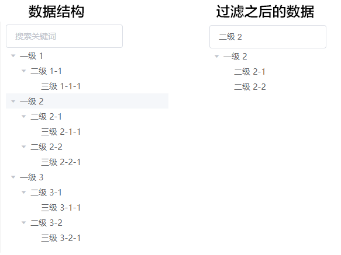

JS树形结构数据筛选过滤递归算法实现



树形结构经常遇到顶部有搜索功能需求，实现方法即可以调用后端接口进行数据过滤，也可以纯前端写递归算法实现

## 实现
### 数据结构
```js
let data = [
  {
    label: "一级 1",
    children: [
      {
        label: "二级 1-1",
        children: [
          {
            label: "三级 1-1-1",
          },
        ],
      },
    ],
  },
  {
    label: "一级 2",
    children: [
      {
        label: "二级 2-1",
        children: [
          {
            label: "三级 2-1-1",
          },
        ],
      },
      {
        label: "二级 2-2",
        children: [
          {
            label: "三级 2-2-1",
          },
        ],
      },
    ],
  },
  {
    label: "一级 3",
    children: [
      {
        label: "二级 3-1",
        children: [
          {
            label: "三级 3-1-1",
          },
        ],
      },
      {
        label: "二级 3-2",
        children: [
          {
            label: "三级 3-2-1",
          },
        ],
      },
    ],
  },
]
```

### 实现方法
```js
/*
* arr:树形结构数组
*keyword:搜索关键词
*first:是否首次执行
*/
function filterTree(arr, keyword, first = true) {
  if(first){ //首次传入深度克隆数据防止修改源数据
    arr = JSON.parse(JSON.stringify(arr))
  }
  let emptyArr = [];
  for (let item of arr) {
    if (item.label.includes(keyword)) {
      if (item.children && Array.isArray(item.children) && item.children.length > 0) {
        item.children = filterTree(item.children, keyword,false);
      }
      emptyArr.push(item);
    } else if (item.children&&Array.isArray(item.children) && item.children.length > 0) {
      item.children = filterTree(item.children, keyword,false);
      if (item.children.length) {
        emptyArr.push(item);
      }
    }
  }
  return emptyArr;
}
```

### 调用
```js
filterTree(data, '二级 2')
```


