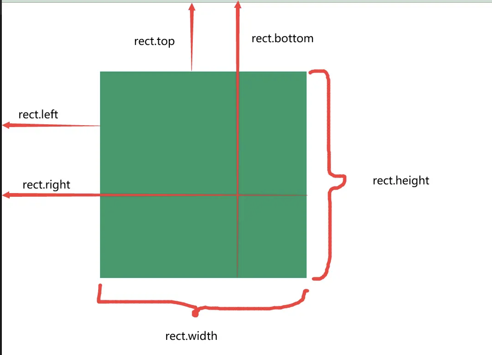
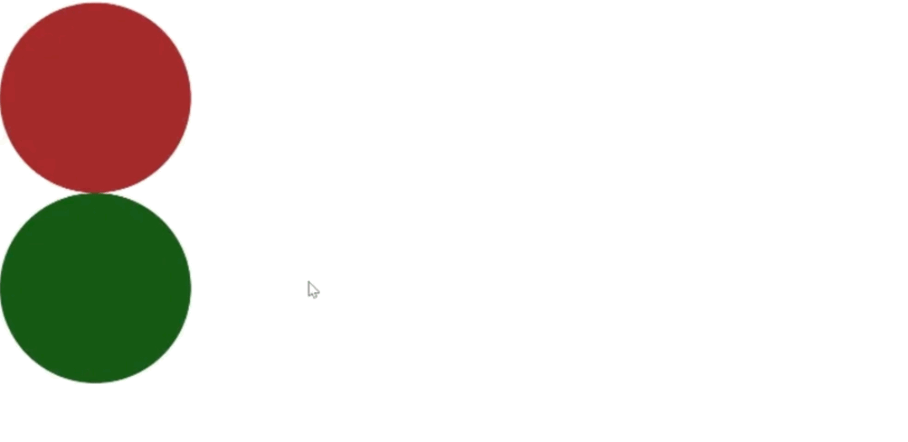

JS高级方法

在Js中有一些比较冷门但是非常好用的方法，我在这里称之为高级方法，这些方法没有被广泛使用或多或少是因为存在一些兼容性的问题。这篇文章主要就是对这些方法做一个总结，有些方法在我们开发过程中有着重要的作用。

## getBoundingClientRect()
`getBoundingClientRect()` 是一个用于获取元素位置和尺寸信息的方法。它返回一个 `DOMRect` 对象，其提供了元素的大小及其相对于视口的位置，其中包含了以下属性：
- x：元素左边界相对于视口的 x 坐标。
- y：元素上边界相对于视口的 y 坐标。
- width：元素的宽度。
- height：元素的高度。
- top：元素上边界相对于视口顶部的距离。
- right：元素右边界相对于视口左侧的距离。
- bottom：元素下边界相对于视口顶部的距离。
- left：元素左边界相对于视口左侧的距离。
### 用法
```js
const box = document.getElementById('box');
const rect = box.getBoundingClientRect();

console.log(rect.x);        // 元素左边界相对于视口的 x 坐标
console.log(rect.y);        // 元素上边界相对于视口的 y 坐标
console.log(rect.width);    // 元素的宽度
console.log(rect.height);   // 元素的高度
console.log(rect.top);      // 元素上边界相对于视口顶部的距离
console.log(rect.right);    // 元素右边界相对于视口左侧的距离
console.log(rect.bottom);   // 元素下边界相对于视口顶部的距离
console.log(rect.left);     // 元素左边界相对于视口左侧的距离
```
如图


### 应用场景
这个方法通常用于需要获取元素在视口中的位置和尺寸信息的场景，比如实现拖拽、定位或响应式布局等，兼容性很好，一般用滚动事件比较多。

特殊场景会用上，比如你登录了淘宝的网页，当你下拉滑块的时候，下面的图片不会立即加载出来，有一个懒加载的效果。当上面一张图片没在可视区内时，就开始加载下面的图片。

下面代码就是判断一个容器是否出现在可视窗口内：
```js
 
 const box = document.getElementById('box')
 window.onscroll = function () {//window.addEventListener('scroll',()=>{})
  console.log(checkInView(box));
 }

function checkInView(dom) {
const { top, left, bottom, right } = dom.getBoundingClientRect();
 return top > 0 &&
        left > 0 &&
        bottom <= (window.innerHeight || document.documentElement.clientHeight) &&
       right <= (window.innerWidth || 
       document.documentElement.clientWidth)
        }
```
当容器在可视区域内就输出true，否则就是false

## intersectionObserver
`IntersectionObserver` 是一个构造函数，可以接收两个参数，第一个参数是一个回调函数，第二个参数是一个对象。这个方法用于观察元素相交情况，它可以异步地监听一个或多个目标元素与其祖先元素或视口之间的交叉状态。它提供了一种有效的方法来检测元素是否可见或进入视口。
### 用法
1. 创建一个 IntersectionObserver 实例，传入一个回调函数和可选的配置对象。
```js
const observer = new IntersectionObserver(callback, options);
const callback = (entries, observer) => {
  // 处理交叉状态变化的回调函数
};

const options = {
  // 可选配置
};
```
2. 将要观察的目标元素添加到观察者中。
```js
const target = document.querySelector('#targetElement');
observer.observe(target);
```
3. 在回调函数中处理交叉状态的变化。
```js
const callback = (entries, observer) => {
  entries.forEach(entry => {
    if (entry.isIntersecting) {
      // 元素进入视口
    } else {
      // 元素离开视口
    }
  });
};
```
`entries` 参数是一个包含每个目标元素交叉状态信息的数组。每个 entry 对象都有以下属性：

- target：观察的目标元素。
- intersectionRatio：目标元素与视口的交叉比例，值在 0 到 1 之间。
- isIntersecting：目标元素是否与视口相交。
- intersectionRect：目标元素与视口的交叉区域的位置和尺寸信息。

`options` 对象是可选的配置，其中常用的配置选项包括：

- root：指定观察器的根元素，默认为视口。
- rootMargin：设置根元素的外边距，用于扩大或缩小交叉区域。
- threshold：指定交叉比例的阈值，可以是单个数值或由多个数值组成的数组。

### 应用场景
IntersectionObserver 适用于实现懒加载、无限滚动、广告展示和可视化统计等场景，同样可以判断元素是否在某一个容器内，不会引起回流。

## createNodeIterator()
createNodeIterator() 方法是 DOM API 中的一个方法，用于创建一个 NodeIterator 对象，可以用于遍历文档树中的一组 DOM 节点。

通俗一点来讲就是它可以遍历 DOM 结构，把 DOM 变成可遍历的。
### 用法
假如： 面试官问你怎样实现遍历 DOM 结构？其实就可以用到这个方法。因为我们在日常开发中这个方法用得极少。这个方法常在框架源码中体现。
### 应用场景
```html
<body>
<div id="app">
  <p>hello</p>
  <div class="title">标题</div>
  <div>
    <div class="content">内容</div>
  </div>
</div>

<script>
  const body = document.getElementsByTagName('body')[0]
  const item = document.createNodeIterator(body)//让body变成可遍历的
  let root = item.nextNode() // 下一层

  while (root) {
    console.log(root);
    if (root.nodeType !== 3) {
      root.setAttribute('data-index', 123)//给每个节点添加一个属性
    }
    root = item.nextNode()
  }
</script>
</body>
```
上面代码成功遍历到了各个 DOM 结构：


并且在每个 DOM 节点上都添加了`data-index = "123"`。

## getComputedStyle()
getComputedStyle()是一个可以获取当前元素所有最终使用的CSS属性值的方法。返回的是一个CSS样式声明对象。

这个方法有两个参数，第一个参数是你想要获取哪个元素的 CSS ，第二个参数是一个伪元素。
### 用法
```css
#box {
  width: 200px;
  height: 200px;
  background-color: cornflowerblue;
  position: relative;
}

#box::after {
  content: "";
  width: 50px;
  height: 50px;
  background: #000;
  position: absolute;
  top: 0;
  left: 0;
}
```
```js
 const box = document.getElementById('box')
 const style = window.getComputedStyle(box, 'after')

 const height = style.getPropertyValue('height')
 const width = style.getPropertyValue('width')

 console.log(style);
 console.log(width, height);
```
上述代码输出结果为：
```shell
CSSStyleDeclaration

50px 50px
```
有一个 id 为 box 容器的 CSS 样式声明对象，以及伪元素的宽高。

## requestAnimationFrame()
上面4种方法我们可能用得不是很多，但是`requestAnimationFrame`方法相对使用较多。`requestAnimationFrame()` 是一个用于在下一次浏览器重绘之前调用指定函数的方法，它是 HTML5 提供的 API。
### 与setInterval和setTimeout
`requestAnimationFrame` 的调用频率通常为每秒60次。这意味着我们可以在每次重绘之前更新动画的状态，并确保动画流畅运行，而不会对浏览器的性能造成影响。

`setInterval` 与 `setTimeout` 它可以让我们在指定的时间间隔内重复执行一个操作，不会考虑浏览器的重绘，而是按照指定的时间间隔执行回调函数，可能会被延迟执行，从而影响动画的流畅度。
### 效果对比
我们设置了两个容器，分别用requestAnimationFrame()方法和setTimeout方法进行平移效果，Js 代码如下所示：
```js
let distance = 0
let box = document.getElementById('box')
let box2 = document.getElementById('box2')

window.addEventListener('click', function () {

 requestAnimationFrame(function move() {
 box.style.transform = `translateX(${distance++}px)`
 requestAnimationFrame(move)//递归
  })

setTimeout(function change() {
 box2.style.transform = `translateX(${distance++}px)`
 setTimeout(change, 17)
    }, 17)
})
```


可能我们肉眼看得不是很清楚，但是确实下面的图形平移没有上面图形流畅，用setTimeout会有卡顿现象。


