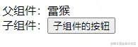
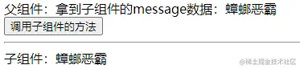

Vue3 10种组件通讯方式

## 实现方式
1. Props
2. emits
3. expose / ref
4. v-model
5. 插槽 slot
6. provide / inject
7. 总线 bus
8. Pinia

### Props
[props 文档](https://cn.vuejs.org/guide/components/props.html)

父组件传值给子组件（简称：父传子）

父组件
```vue
<template>
  <!-- 使用子组件 -->
  <Child :msg="message" />
</template>

<script setup>
import Child from './components/Child.vue' // 引入子组件
let message = '雷猴'
</script>
```
子组件
```vue
<template>
  <div>
    {{ msg }}
  </div>
</template>

<script setup>
const props = defineProps({
  msg: {
    type: String,
    default: ''
  }
})
console.log(props.msg) // 在 js 里需要使用 props.xxx 的方式使用。在 html 中使用不需要 props
</script>
```
在`<script setup>`中必须使用`defineProps` API来声明`props`，它具备完整的推断并且在`<script setup>`中是直接可用的。

在`<script setup>`中`defineProps`不需要另外引入。

### emits
[emits 文档](https://v3.cn.vuejs.org/guide/migration/emits-option.html)

子组件通知父组件触发一个事件，并且可以传值给父组件。（简称：子传父）



父组件
```vue
<template>
  <div>父组件：{{ message }}</div>
  <!-- 自定义 changeMsg 事件 -->
  <Child @changeMsg="changeMessage" />
</template>

<script setup>
import { ref } from 'vue'
import Child from './components/Child.vue'

let message = ref('雷猴')

// 更改 message 的值，data是从子组件传过来的
function changeMessage(data) {
  message.value = data
}
</script>
```

子组件
```vue
<template>
  <div>
    子组件：<button @click="handleClick">子组件的按钮</button>
  </div>
</template>

<script setup>

// 注册一个自定义事件名，向上传递时告诉父组件要触发的事件。
const emit = defineEmits(['changeMsg'])

function handleClick() {
  // 参数1：事件名
  // 参数2：传给父组件的值
  emit('changeMsg', '鲨鱼辣椒')
}

</script>
```
和 `props` 一样，在 `<script setup>` 中必须使用 `defineEmits` API 来声明 `emits`，它具备完整的推断并且在 `<script setup>` 中是直接可用的.

在 `<script setup>` 中，`defineEmits` 不需要另外引入。

### expose / ref
[expose 文档](https://cn.vuejs.org/api/options-state.html#expose)

子组件可以通过 `expose` 暴露自身的方法和数据。

父组件通过 `ref` 获取到子组件并调用其方法或访问数据。



父组件
```vue
<template>
  <div>父组件：拿到子组件的message数据：{{ msg }}</div>
  <button @click="callChildFn">调用子组件的方法</button>

  <hr>

  <Child ref="com" />
</template>

<script setup>
import { ref, onMounted } from 'vue'
import Child from './components/Child.vue'

const com = ref(null) // 通过 模板ref 绑定子组件

const msg = ref('')

onMounted(() => {
  // 在加载完成后，将子组件的 message 赋值给 msg
  msg.value = com.value.message
})

function callChildFn() {
  // 调用子组件的 changeMessage 方法
  com.value.changeMessage('蒜头王八')

  // 重新将 子组件的message 赋值给 msg
  msg.value = com.value.message
}
</script>
```
子组件
```vue
<template>
  <div>子组件：{{ message }}</div>
</template>

<script setup>
import { ref } from 'vue'

const message = ref('蟑螂恶霸')

function changeMessage(data) {
  message.value = data
}

//使用 defineExpose 向外暴露指定的数据和方法
defineExpose({
  message,
  changeMessage
})

</script>
```
在 `<script setup> `中，defineExpose 不需要另外引入。
### v-model
`v-model` 是 `Vue` 的一个语法糖。

#### 单值的情况

组件上的 `v-model` 使用 `modelValue` 作为 prop 和 `update:modelValue` 作为事件。

父组件
```vue
<template>
  <Child v-model="message" />
</template>

<script setup>
import { ref } from 'vue'
import Child from './components/Child.vue'

const message = ref('雷猴')
</script>

```
子组件
```vue
<template>
  <div @click="handleClick">{{modelValue}}</div>
</template>

<script setup>
import { ref } from 'vue'
// 接收
const props = defineProps([
  'modelValue' // 接收父组件使用 v-model 传进来的值，必须用 modelValue 这个名字来接收
])
const emit = defineEmits(['update:modelValue']) // 必须用 update:modelValue 这个名字来通知父组件修改值
function handleClick() {
  // 参数1：通知父组件修改值的方法名
  // 参数2：要修改的值
  emit('update:modelValue', '喷射河马')
}
</script>

或者这样写

<template>
  <div @click="$emit('update:modelValue', '喷射河马')">{{modelValue}}</div>
</template>

<script setup>
import { ref } from 'vue'
// 接收
const props = defineProps([
  'modelValue' // 接收父组件使用 v-model 传进来的值，必须用 modelValue 这个名字来接收
])
</script>

```
#### 多个 v-model 绑定
父组件
```vue
<template>
  <Child v-model:msg1="message1" v-model:msg2="message2" />
</template>

<script setup>
import { ref } from 'vue'
import Child from './components/Child.vue'

const message1 = ref('雷猴')

const message2 = ref('蟑螂恶霸')
</script>

```
子组件
```vue
<template>
  <div><button @click="changeMsg1">修改msg1</button> {{msg1}}</div>

  <div><button @click="changeMsg2">修改msg2</button> {{msg2}}</div>
</template>

<script setup>
import { ref } from 'vue'

// 接收
const props = defineProps({
  msg1: String,
  msg2: String
})

const emit = defineEmits(['update:msg1', 'update:msg2'])

function changeMsg1() {
  emit('update:msg1', '鲨鱼辣椒')
}

function changeMsg2() {
  emit('update:msg2', '蝎子莱莱')
}
</script>
```
#### v-model 修饰符
`v-model` 还能通过 `.` 的方式传入修饰。

父组件
```vue
<template>
  <Child v-model.uppercase="message" />
</template>

<script setup>
import { ref } from 'vue'
import Child from './components/Child.vue'

const message = ref('hello')
</script>
```
子组件
```vue
<template>
  <div>{{modelValue}}</div>
</template>

<script setup>
import { ref, onMounted } from 'vue'

const props = defineProps([
  'modelValue',
  'modelModifiers'
])

const emit = defineEmits(['update:modelValue'])

onMounted(() => {
  // 判断有没有 uppercase 修饰符，有的话就执行 toUpperCase() 方法
  if (props.modelModifiers.uppercase) {
    emit('update:modelValue', props.modelValue.toUpperCase())
  }
})

</script>
```
### 插槽 slot
插槽可以理解为传一段 HTML 片段给子组件。子组件将 `<slot>` 元素作为承载分发内容的出口。

打算讲讲日常用得比较多的3种插槽：`默认插槽`、`具名插槽`、`作用域插槽`。

#### 默认插槽
插槽的基础用法非常简单，只需在子组件中使用 `<slot>` 标签，就会将父组件传进来的 HTML 内容渲染出来。

父组件
```vue
<template>
  <Child>
    <div>雷猴啊</div>
  </Child>
</template>
```
子组件
```vue
<template>
  <div>
    <slot></slot>
  </div>
</template>
```
#### 具名插槽
`具名插槽` 就是在 `默认插槽` 的基础上进行分类，可以理解为对号入座。

父组件
```vue
<template>
  <Child>
    <template v-slot:monkey>
      <div>雷猴啊</div>
    </template>

    <button>鲨鱼辣椒</button>
  </Child>
</template>
```
子组件
```vue
<template>
  <div>
    <!-- 默认插槽 -->
    <slot></slot>
    <!-- 具名插槽 -->
    <slot name="monkey"></slot>
  </div>
</template>
```
父组件需要使用 `<template>` 标签，并在标签上使用 `v-solt: + 名称` 。

子组件需要在 `<slot>` 标签里用 `name= 名称` 对应接收。

这就是 `对号入座`。

最后需要注意的是，插槽内容的排版顺序，是 `以子组件里的排版为准`。

#### 作用域插槽
如果你用过 `Element-Plus` 这类 UI框架 的 `Table` ，应该就能很好的理解什么叫作用域插槽。

父组件
```vue
<template>
  <!-- v-slot="{scope}" 获取子组件传上来的数据 -->
  <!-- :list="list" 把list传给子组件 -->
  <Child v-slot="{scope}" :list="list">
    <div>
      <div>名字：{{ scope.name }}</div>
      <div>职业：{{ scope.occupation }}</div>
      <hr>
    </div>
  </Child>
</template>

<script setup>
import { ref } from 'vue'
import Child from './components/Child.vue'

const list = ref([
  { name: '雷猴', occupation: '打雷'},
  { name: '鲨鱼辣椒', occupation: '游泳'},
  { name: '蟑螂恶霸', occupation: '扫地'},
])
</script>
```
子组件
```vue
<template>
  <div>
    <!-- 用 :scope="item" 返回每一项 -->
    <slot v-for="item in list" :scope="item" />
  </div>
</template>

<script setup>
const props = defineProps({
  list: {
    type: Array,
    default: () => []
  }
})
</script>
```

### provide / inject
遇到多层传值时，使用 `props` 和 `emit` 的方式会显得比较笨拙。这时就可以用 `provide` 和 `inject` 了。

`provide` 是在父组件里使用的，可以往下传值。

`inject` 是在子(后代)组件里使用的，可以往上取值。

无论组件层次结构有多深，父组件都可以作为其所有子组件的依赖提供者。

父组件
```vue
<template>
  <Child></Child>
</template>

<script setup>
import { ref, provide, readonly } from 'vue'
import Child from './components/Child.vue'

const name = ref('猛虎下山')
const msg = ref('雷猴')

// 使用readonly可以让子组件无法直接修改，需要调用provide往下传的方法来修改
provide('name', readonly(name))

provide('msg', msg)

provide('changeName', (value) => {
  name.value = value
})
</script>
```
子组件
```vue
<template>
  <div>
    <div>msg: {{ msg }}</div>
    <div>name: {{name}}</div>
    <button @click="handleClick">修改</button>
  </div>
</template>

<script setup>
import { inject } from 'vue'

const name = inject('name', 'hello') // 看看有没有值，没值的话就适用默认值（这里默认值是hello）
const msg = inject('msg')
const changeName = inject('changeName')

function handleClick() {
  // 这样写不合适，因为vue里推荐使用单向数据流，当父级使用readonly后，这行代码是不会生效的。没使用之前才会生效。
  // name.value = '雷猴'

  // 正确的方式
  changeName('虎躯一震')

  // 因为 msg 没被 readonly 过，所以可以直接修改值
  msg.value = '世界'
}
</script>
```
`provide` 可以配合 `readonly` 一起使用，详情可以看上面例子和注释。

`provide` 和 `inject` 其实主要是用在深层关系中传值，上面的例子只有父子2层，只是为了举例说明。

### 总线 bus
在 `Vue2` 有总线传值的方法，我们在 `Vue3` 中也可以自己模拟。

这个方式其实有点像 `Vuex` 或者 `Pinia` 那样，弄一个独立的工具出来专门控制数据。

但和 `Vuex` 或 `Pinia` 相比，我们自己写的这个方法并没有很好的数据跟踪之类的特性。

#### 原理
我们创建一个 `Bus.js` 文件，用来控制数据和注册事件的。

`Bus.js` 里有一个 `Bus` 类
- `eventList` 是必须项，用来存放事件列表的。
- `constructor` 里除了 `eventList` 外，其他都是自定义数据，公共数据就是存在这里的。
- `$on` 方法用来注册事件。
- `$emit` 方法可以调用 `$on` 里的事件。
- `$off` 方法可以注销 `eventList` 里的事件。
- 
然后需要用到总线的组件，都导入 `Bus.js` ，就可以共同操作一份数据了。

#### Bus.js
```js
import { ref } from 'vue'

class Bus {
  constructor() {
    // 收集订阅信息,调度中心
	this.eventList = {}, // 事件列表，这项是必须的
    // 下面的都是自定义值
	this.msg = ref('这是一条总线的信息')
  }

  // 订阅
  $on(name, fn) {
	this.eventList[name] = this.eventList[name] || []
	this.eventList[name].push(fn)
  }

  // 发布
  $emit(name, data) {
	if (this.eventList[name]) {
      this.eventList[name].forEach((fn) => {
        fn(data)
      });
	}
  }

  // 取消订阅
  $off(name) {
      if (this.eventList[name]) {
	  delete this.eventList[name]
	}
  }
}

export default new Bus()
```
父组件
```vue
<template>
  <div>
    父组件: 
    <span style="margin-right: 30px;">message: {{ message }}</span>
    <span>msg: {{ msg }}</span>
  </div>
  <Child></Child>
</template>

<script setup>
import { ref } from 'vue'
import Bus from './Bus.js'
import Child from './components/Child.vue'

const msg = ref(Bus.msg)

const message = ref('hello')

// 用监听的写法
Bus.$on('changeMsg', data => {
  message.value = data
})

</script>
```
子组件
```vue
<template>
  <div>
    子组件：
    <button @click="handleBusEmit">触发Bus.$emit</button>
    <button @click="changeBusMsg">修改总线里的 msg</button>
  </div>
</template>

<script setup>
import Bus from '../Bus.js'

function handleBusEmit() {
  Bus.$emit('changeMsg', '雷猴啊')
}

function changeBusMsg() {
  // console.log(Bus.msg)
  Bus.msg.value = '在子组件里修改了总线的值'
}
</script>
```
这个方法其实还挺好用的，但光看可能有点懵，实操一下比较清晰。

### Pinia
`Pinia` 是最近比较火热的一个工具，也是用来处理 `跨组件通信` 的

`Pinia` 简化了状态管理模块，只用这3个东西就能应对日常大多任务。

- `state`：存储数据的仓库
- `getters`：获取和过滤数据（跟 `computed` 有点像）
- `actions`：存放 “修改 `state` ”的方法

#### 安装
::: code-group
```sh [npm]
$ npm install pinia
```
```sh [yarn]
$ yarn add pinia
```
:::
#### 注册
在 `src` 目录下创建 `store` 目录，再在 `store` 里创建 `index.ts` 和 `user.ts`

目录结构如下
```shell
store
|- index.ts
|- user.ts
```
index.ts
```js
import { createPinia } from 'pinia'

const store = createPinia()

export default store
```
user.ts

常见的写法有2种，选其中一种就行。
```ts
import { defineStore } from 'pinia'

// 写法1
export const useUserStore = defineStore({
  id: 'user', // id必填，且需要唯一
  state: () => {
    return {
      name: '雷猴'
    }
  },
  getters: {
    fullName: (state) => {
      return '我叫 ' + state.name
    }
  },
  actions: {
    updateName(name) {
      this.name = name
    }
  }
})

// 写法2
export const useUserStore = defineStore('user',{
  state: () => {
    return {
      name: '雷猴'
    }
  },
  getters: {
    fullName: (state) => {
      return '我叫 ' + state.name
    }
  },
  actions: {
    updateName(name) {
      this.name = name
    }
  }
})
```
然后在 `src/main.ts` 中引入 `store/index.ts`

src/main.ts
```ts
import { createApp } from 'vue'
import App from './App.vue'
import store from './store'

const app = createApp(App)

app
  .use(store)
  .mount('#app')

```
#### 在组件中使用

组件

```vue
// xxx.vue
<template>
  <div>
    <div>name: {{ name }}</div>
    <div>全名：{{ fullName }}</div>
    <button @click="handleClick">修改</button>
  </div>
</template>

<script setup>
import { computed } from 'vue'
import { storeToRefs } from 'pinia'
import { useUserStore } from '@/store/user'

const userStore = useUserStore()

// const name = computed(() => userStore.name)

// 建议
const { name, fullName } = storeToRefs(userStore)


function handleClick() {
  // 不建议这样改
  // name.value = '蝎子莱莱'

  // 推荐的写法！！！
  userStore.updateName('李四')
}
</script>
```
`Pinia` 还提供了多种语法糖，强烈建议阅读一下


