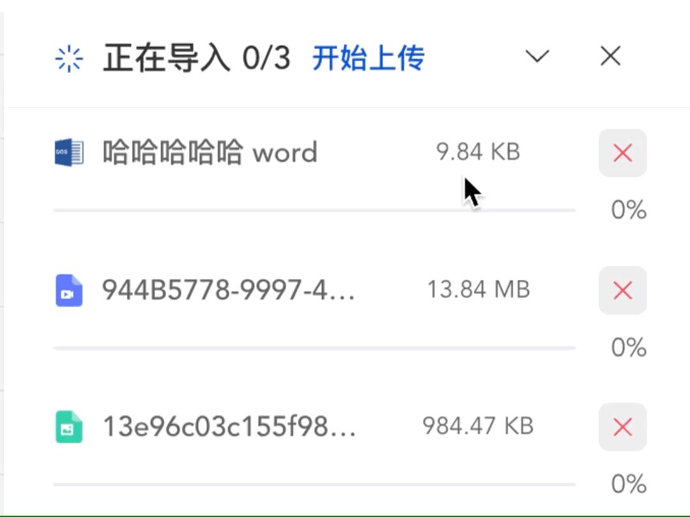

自定义指令：showTip

## 问题描述
最近在做项目的时候遇到一个样式，文本超出某个宽度的时候需要展示...，鼠标移上去展示提示信息，如果过没有超出宽度则不展示提示框。这篇文章主要就是介绍如何实现的。

## 实现思路
首先我们分析一下要根据文本的宽度是否超过展示提示框，那么就必须要获取文本的宽度和容器的宽度，然后还要根据`el-tooltip`的`disabled`属性来判断是否需要展示`tool-tip`。我们可以通过自定义一个指令来是实现。大致思路如下：

1. 获取容器的宽度，获取文本的宽度。
2. 判断宽度，并且监听`mouseenter`事件，如果文本的`宽度 > 容器`的宽度, 就将 `tool-tip` 的 `disabled` 的属性设置为 `false`，否则就设置为 `true`

:::tip 特别注意
1. 在vue3中，我们不能将指定绑定在el-tooltip上，而是需要绑定在el-tooltip的外层容器上。因此在获取元素的时候就需要在外层容器上内查找el-tooltop。
2. 在计算元素的宽度的时候还要考虑左右的padding的大小
   :::

## 代码实现


### 1. 创建一个自定义指令文件`showTip.js`。该文件放在`directives`文件夹下。内容如下：
```ts
import { getStyle } from 'element-plus/lib/utils/dom/index';
import {App, DirectiveBinding} from "vue";
const showTip = {
  mounted(el: HTMLElement, binding: DirectiveBinding, vnode: any) {
    bindEvent(el, binding, vnode)
  },
  updated(el: HTMLElement, binding: DirectiveBinding, vnode: any) {
    bindEvent(el, binding, vnode)
  }
};
function bindEvent(el: HTMLElement, bindings: DirectiveBinding, vnode: any) {
  let tooltipNode = vnode.children.find((childCmpt: any) => childCmpt.component?.type.name == 'ElTooltip');
  if (tooltipNode) {
    // let { content } = tooltipNode.props;
    el.addEventListener('mouseenter', () => {
      const child = el.querySelector('.name-title')
      tooltipNode.component.props.disabled = true;
      const range = document.createRange();
      range.setStart(el, 0);
      range.setEnd(el, el.childNodes.length);
      const rangeWidth = Math.round(range.getBoundingClientRect().width);
      const padding = (parseInt(getStyle(el, 'paddingLeft'), 10) || 0)
      // @ts-ignore
      if (rangeWidth + padding > el.offsetWidth || child.scrollWidth > child.offsetWidth) {
        tooltipNode.component.props.disabled = false;
      }
    });
    el.addEventListener('mouseleave', () => {
      tooltipNode.component.props.disabled = true;
    })
  }
}
// export default showTip;
export function setupShowTip(app: App) {
  app.directive('show-tip', showTip);
}
```

### 2. 全局引入
在main.js中引入该指令文件
```ts
import { createApp } from 'vue'
import App from './App.vue'
import router from "./router";
import ElementPlus from 'element-plus'
import 'element-plus/dist/index.css'
import {setupShowTip} from '@/directives/showTip';

const app = createApp(App);
app.use(setupShowTip).use(router).use(ElementPlus, {
  locale: zhCn,
}).mount('#app')
```
### 3. 组件中使用
在需要使用的组件中使用该指令
```vue
<template>
  <div class="name" v-show-tip>
    <el-tooltip effect="dark" :content="item.file_name" placement="top">
      <div class="file-name-item">
        <span class="name-title text-overflow" style="margin-left: 8px">{{item.file_name}}</span>
      </div>
    </el-tooltip>
  </div>
</template>
<style lang="scss" scoped>
.file-name-item {
  max-width: 150px;
  flex: 1;
  width: 1%;
  font-weight: 500;
  display: flex;
  align-items: center;
}
</style>
```
效果如下： 文本超出，鼠标移上去就会展示提示信息。


## 总结
文本超出展示详细信息在实际开发中是经常会用到的，自定义一个指令，这样需要的时候就可以直接引用了。


