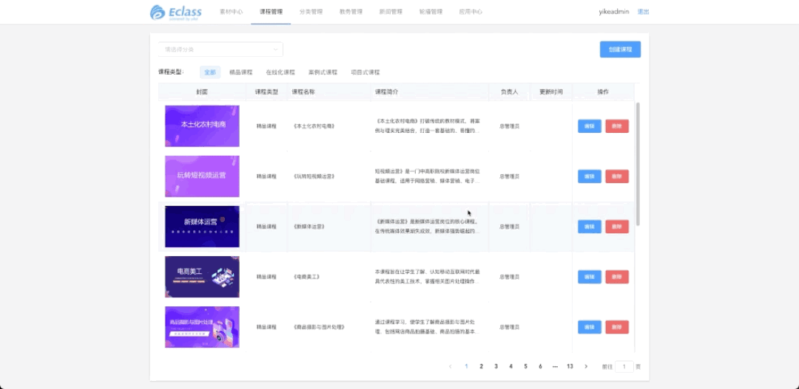

[//]: # ([电子商务师]&#40;http://zteen.yikeos.com/&#41;)
电子商务师

## 产品简介
电子商务师等级考核平台以电子商务师考试大纲、职业技能证书标准等要求为依据，配套教学资源、考试题库、实训模拟题库，满足师生日常上课学习、考试训练等工作，并形成训练记录、考试记录，并有大数据模块进行统计，满足培训组织、院校对学生情况跟踪了解。系统能自动生成一份职业能力评测报告，并自定义证书模板批量生成证书以便下载打印等操作。系统为 B/S 架构，无须客户端安装，方便维护。

## 使用的技术
- vue-cli
- vue2
- element-ui
- vuex

## 主要负责内容
负责模块太多，不一一列举
- 超管：实操题—>试题添加、试卷添加，热门关键词、粉丝特征、数据中心，创建课程
- 教师端：数据中心

  ...

## 部分页面截图

