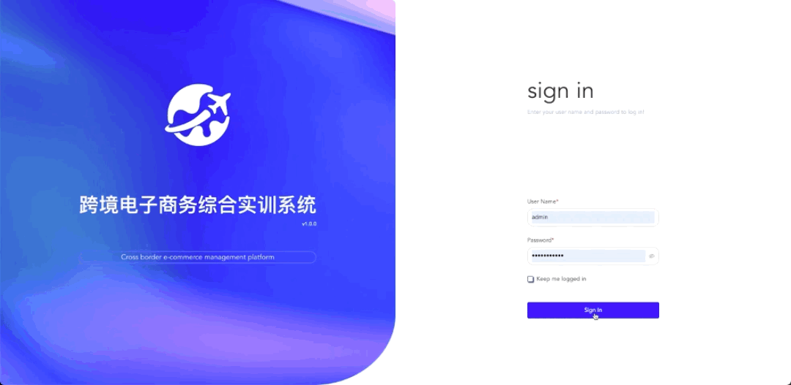

[//]: # ([跨境综合竞赛系统]&#40;https://kuajing.hzyyun.com/#/&#41;)
跨境综合竞赛系统

## 产品简介
跨境综合竞赛系统利用数据库管理技术，该系统采用B/S架构，搭建云服务器，学生可以随时随地学习，不受地点和时间的限制，结合跨境电子商务运营职业技能竞赛平台，把后台管理、竞赛模块、竞赛评分模块及排名统计集成一体，强大的系统后台、丰富的竞赛项目、智能的评分系统及统计排名，实现竞赛管理的流程化、规范化及科学化，使跨境电子商务运营职业技能竞赛更加公正、公平、公开。

## 使用的技术
- vite
- vue3
- element-plus
- pinia
- typescript

## 主要负责内容
- 超管：教务管理、店铺装修、阿里云OSS管理、运营推广->店铺营销、搜索广告商品、展位广告
- 学校管理员：教务管理
- 学生端：头程管理、店铺注册->Lazada

## 部分页面截图

