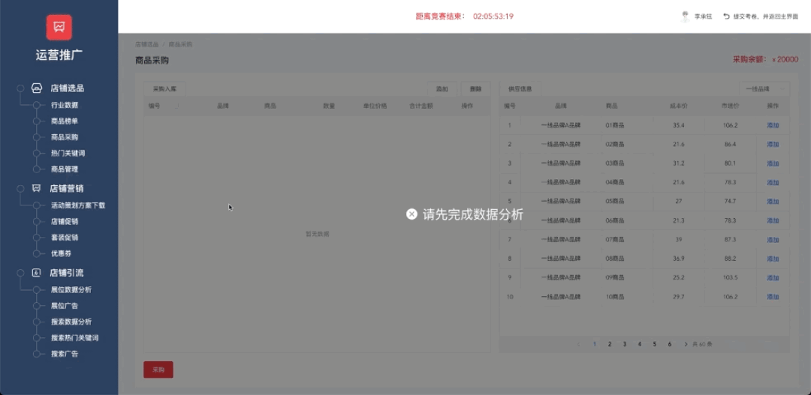

[//]: # ([新媒体实战系统软件]&#40;https://media.yikeos.com/&#41;)
新媒体实战系统软件

## 产品简介
新媒体实战教学平台基于企业新媒体从业人员的岗位技能要求，采用任务考核方式，搭建一个具备平台操作、热点捕捉、素材搜集、图片处理、视频剪辑、图文编辑、粉丝维护、数据统计与初步分析等实训项目的职业技能训练空间，通过知识、技能和素养的三维综合训练，平台采用 B/S 架构，搭建云服务器，师生可以随时随地使用，不受地点和时间的限制，并与优酷、爱奇艺、今日头条、企鹅媒体、网易媒体、新浪微博、秒拍等20 余家主流新媒体平台合作，获取实时数据。满足学校对新媒体实战培养的需求，可作为企业招选新媒体人才的参考依据，为学校与企业合作奠定了坚实的基础。

## 使用的技术
- vue-cli
- vue2
- element-ui
- vuex

## 主要负责内容
负责模块太多，不一一列举
- 超管：实训管理、脚本管理、商品管理、数据看板
- 教师端：教学管理
- 学生端：创作中心->文章管理、脚本创作，任务中心、电商分析->淘宝推广排行

  ...

## 部分页面截图

