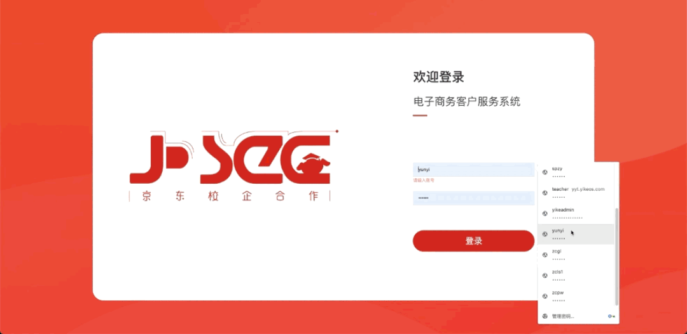

[//]: # ([电子商务客户服务书证融通]&#40;http://onex.yikeos.com/&#41;)
电子商务客户服务书证融通

## 产品简介
网络客服智能教学实战平台提供电商相关理论知识和模拟网店客服客户服务的实操系统和训练数据。智能的评分系统及统计排名，实现竞赛管理的流程化、规范化及科学化，使电子商务考级考试更加公正、公平、公开，引导学生将理论知识应用于实践，利于培养电子商务实践性人才，提升学校的电子商务职业人才的培养水平，完善了学校的教学管理体制，促进学校与机构对学生考级管理的改革与创新，推动和加速我国职业技能竞赛领域事业的发展，提炼优秀的电子商务人才，可作为企业招选人才的参考依据，为学校与企业合作奠定了坚实的基础。

## 使用的技术
- vue-cli
- vue2
- element-ui
- vuex

## 主要负责内容
负责模块太多，不一一列举
- 超管：理论题、实操题、试卷管理
- 学校管理员：数据中心
- 教师端：考试管理
- 学生端：客服考试模块

  ...

## 部分页面截图

