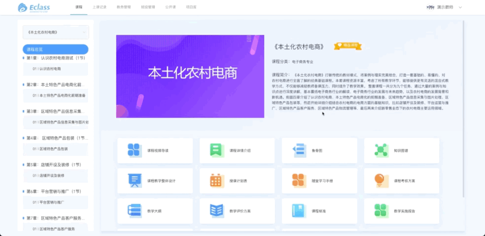

[//]: # ([综合一站式教学云平台]&#40;https://yun.yikeos.com/&#41;)
综合一站式教学云平台

## 产品简介
综合一站式教学与实践云平台为版权课程提供信息化呈现，可帮助教师打造一站式教学、自学、实训、考试、评价体验。同时平台将标准化资源进行颗粒化，老师可根据教学安排将颗粒化的教学资源自定义组合为一门课程进行教学。该系统能够进行混合式教学、翻转课堂，能够与实训系统无缝链接实现实训教学模式。促进学校与机构对学生考级管理的改革与创新，推动和加速我国职业技能竞赛领域事业的发展，提炼优秀的电子商务人才，可作为企业招选人才的参考依据，为学校与企业合作奠定了坚实的基础

## 使用的技术
- vue-cli
- vue2
- element-ui
- vuex

## 主要负责内容
- 超管、学校管理员：素材中心、分类管理、新闻管理
- 学校管理员：数据中心
- 教师端：课程、上课记录、班级管理（上课）
- 学生端：课程、我的班级

## 部分页面截图

