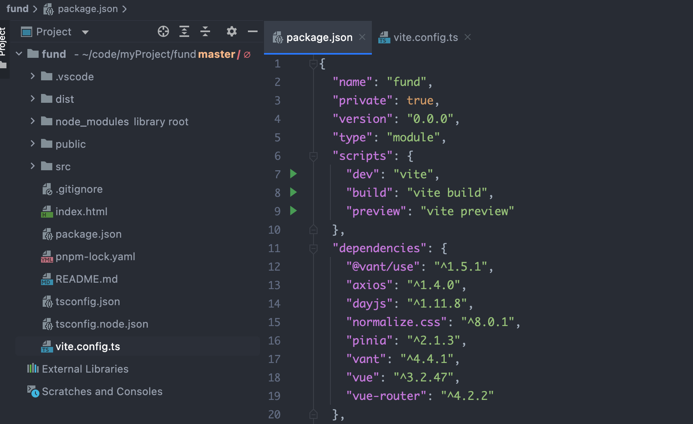
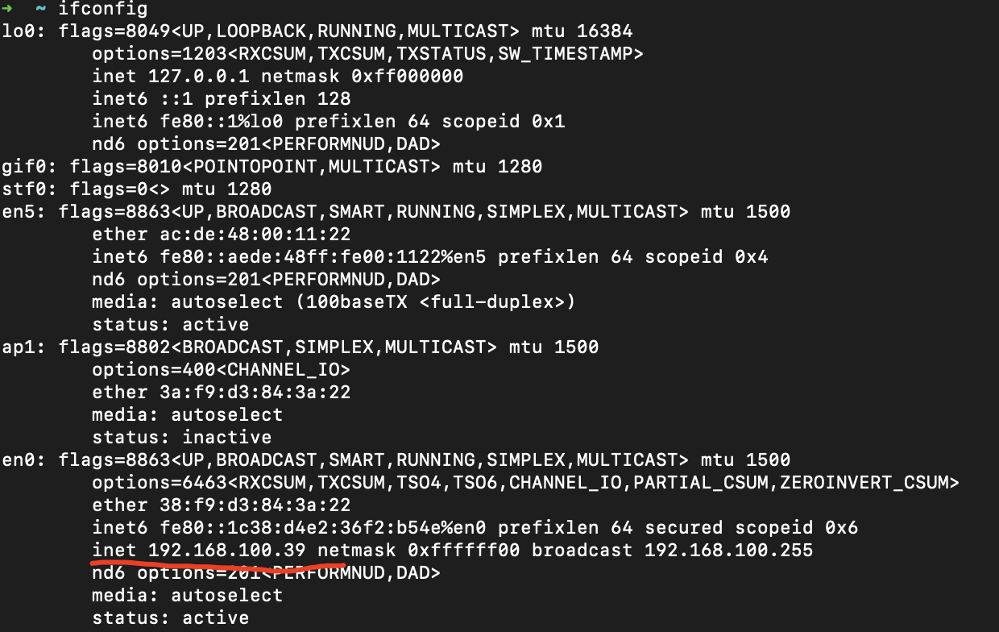
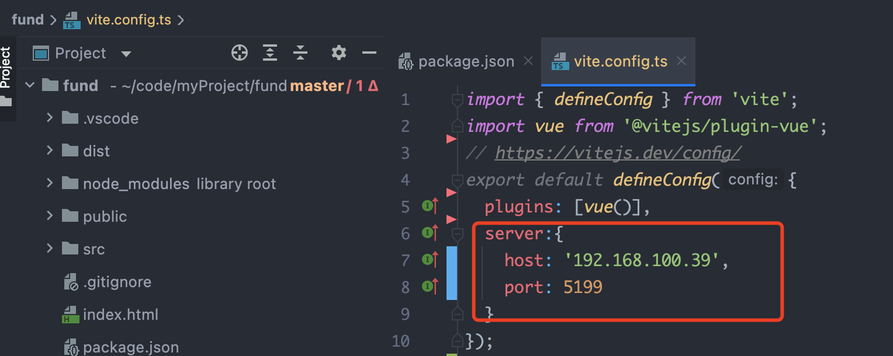

如何在手机上预览或访问vite+vue H5 本地项目

## 操作
### 1.首先已经正常初始化构建了 Vite + Vue 项目

### 2.查询电脑本地ip地址
Mac查询本地ip：打开终端输入命令ifconfig

### 3.修改项目的vite.config.ts文件
在defineConfig添加server项如下。host是你本地ip地址，port端口号可以随意写一个还没被占用的端口

### 4.打开手机并连接与电脑同一个wifi，即确保手机和本地项目服务处于同一局域网
在电脑本地项目pnpm dev启动项目，接着在手机浏览器输入服务地址 http://192.168.100.39:5199/
，即可在手机端浏览到项目主页面。

